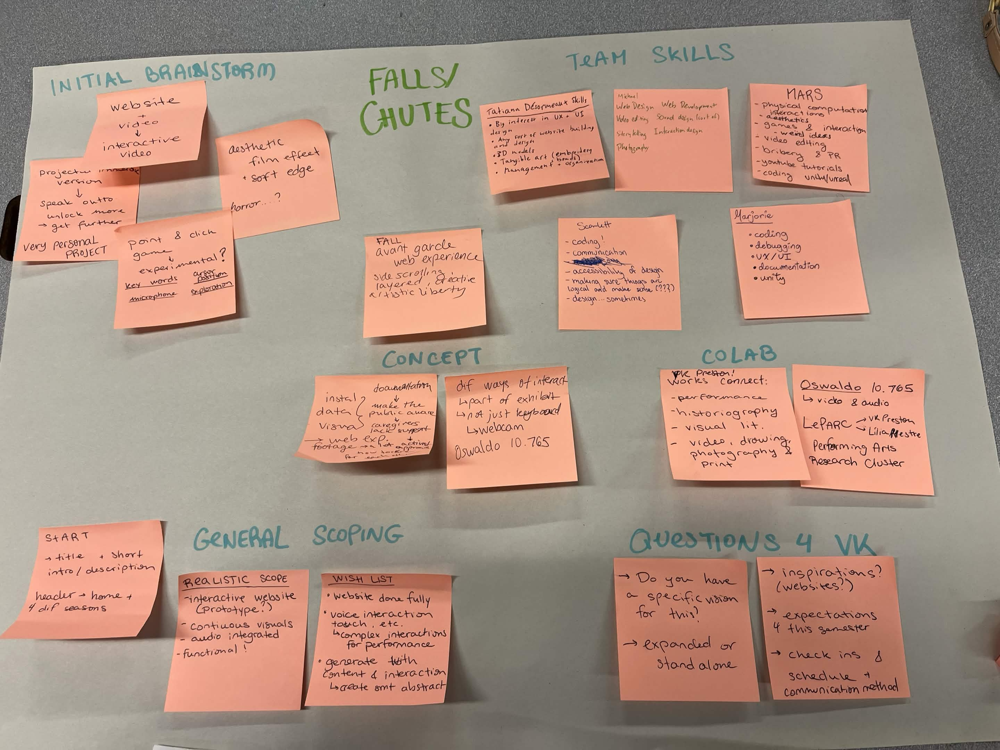

# CART 470 PROJECT PROCESS JOURNAL

## Project
Falls / Chutes by VK Preston

## Team members
1. Micheal Vlamis 
2. Mars Lapierre-Furtado
3. Tatiana Désormeaux
4. Marjorie Dudemaine
5. Scarlett Perez

## Week 2 Progress
During this week, we have communicated throughly as a team. We have concluded what are each other's strengths and weaknesses. But ultimately settled that we would not give each other roles until the moment that we manage to have a proper communication with our client VK Preston. As we want to keep their vision as intact as possible, we settled that it was the best solution.

However, this did not stop us from brainstorming possible options for what to do for the website that our client would want. From how the website would look to whatever extra things we might add. Finally, we have settled on what is the realistic scope to what would be our wishlist. 

Below is our joint notes of our meeting together in week 2:

## Week 3 Progress 
This week we have met up with VK Preston to communicate about their vision for the project.

It has been a very enlightening process as we manage to figure out a lot of questions that we had for them during this meeting. Thankfully, VK has a lot of support around concordia, which means we also have some of this support. VK has agreed to send us some of the assets thanks to Oswaldo who has the bulk of it saved. VK has also shown us multiple of the photographs so we may have more of  a vision for the project. 